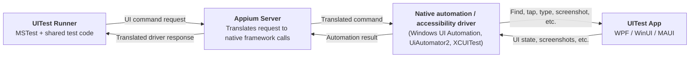
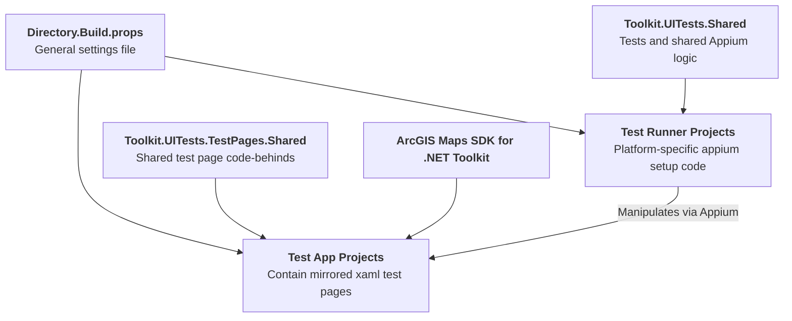

# UITests Design

## Summary

`src\Tests\UITests` is a cross-platform UI test foundation for the repository.

It includes:

- Appium-based UI test runners for six target platforms
- Dedicated test apps for WPF, WinUI, and MAUI
- Shared test logic and shared test page code
- Per-platform setup for building apps and starting Appium sessions
- Initial sample coverage for the Compass control

## Goals

- Run the same UI test scenarios across WPF, WinUI, and MAUI
- Keep test logic shared where possible
- Keep test pages aligned across app frameworks
- Support platform-specific Appium setup without duplicating the tests
- Make it easy to add more control tests over time

## UITests Structure

### 1. UITests workspace

`src\Tests\UITests` contains its own:

- `README.md`
- `Directory.Build.props`
- runner projects
- app projects
- shared test code
- shared test page code

`Directory.Build.props` centralizes test settings such as:

- .NET target versions for runners and apps
- Appium WebDriver and Magick.NET versions
- Android test app behavior
- iOS device and WebDriverAgent settings

### 2. Test runner projects

The UITests area includes six MSTest runner projects:

- `Toolkit.UITests.Wpf`
- `Toolkit.UITests.WinUI`
- `Toolkit.UITests.MauiWinUI`
- `Toolkit.UITests.MauiAndroid`
- `Toolkit.UITests.MauiiOS`
- `Toolkit.UITests.MauiMac`

Each runner imports `Toolkit.UITests.Shared` and keeps only the setup code that is different for that platform.

Several runners also build their test app before test execution and write settings into `AppBuildInfo.txt`. The shared Appium setup reads that file to find the app path, package name, device ID, or other platform settings.

### 3. Shared test layer

`Toolkit.UITests.Shared` contains the common test foundation:

- `AppiumSetup.cs`
- `AppiumTestBase.cs`
- gesture helpers
- image analysis helpers
- crash handling helpers
- the first shared test set

This shared layer handles the common pattern:

1. Read runner-provided build settings when needed
2. Create the correct Appium driver
3. Expose a common base class to the tests
4. Share cross-platform test logic

The first shared scenario is `CompassTests`, which shows how one test can run across different frameworks and platforms.

### 4. Shared test page layer

`Toolkit.UITests.TestPages.Shared` contains shared code-behind and page base types for the test apps.

This keeps the page behavior in one place while still allowing each framework to keep its own XAML file.

The first shared page implementation is:

- `CompassMap.xaml.cs`
- `TestPage.cs`

### 5. Test apps

The UITests area includes three test apps:

- `Toolkit.UITests.Wpf.App`
- `Toolkit.UITests.WinUI.App`
- `Toolkit.UITests.Maui.App`

These apps host mirrored test pages and expose automation IDs and metadata that the tests depend on, such as screen density and version labels.

The MAUI app is multi-targeted for:

- Android
- iOS
- Mac Catalyst
- Windows

This lets one app project support four runner targets.

### 6. Automation-tree and accessibility fixes

The UITests area includes testability work so Appium can reliably find the right UI elements.

Examples:

- `Toolkit.UITests.Maui.App\AppBuilderExtensions.cs` adds a Windows automation-tree workaround for MAUI views
- `Toolkit.UITests.Wpf.App\ControlPatcher.cs` patches WPF automation behavior so more text elements appear to Windows automation tools

These changes are important because the tests depend on the native automation and accessibility tree, not only on the visual tree.

## Runtime Architecture

At runtime, the test system works as a layered request chain.

## Project Architecture

The UITests projects are split into runners, apps, and shared layers.

## Design Decisions

### Shared tests use shared projects

The runners import `Toolkit.UITests.Shared.projitems` instead of referencing a compiled shared test assembly.

This keeps compile-time constants available inside the shared code, which is useful for platform-specific driver types and platform guards.

### Shared page behavior is separate from framework XAML

The app projects keep their framework-specific XAML, while `Toolkit.UITests.TestPages.Shared` keeps the shared behavior.

This reduces duplication without forcing one UI framework model onto the others.

### Runners own platform setup

Each runner project keeps its own Appium setup partial and build target logic.

This is a good fit because app launch rules differ by platform:

- some apps are built automatically
- some must already be installed
- some need a package ID
- iOS needs extra device and WebDriverAgent settings

### Tests use metadata from the app

The test apps expose values like screen density and version text.

This makes tests less fragile and helps normalize checks across devices with different DPI values.

## Current Coverage

The first end-to-end test flow is for Compass behavior:

- test pages exist in all three app frameworks
- shared page logic drives the sample behavior
- shared Appium tests validate auto-hide behavior
- image analysis is used instead of full screenshot matching

This gives the branch a thin but complete vertical slice of the new architecture.

## Benefits

- One test design can be reused across many platforms
- Most test logic lives in one place
- Test pages stay aligned across app frameworks
- Platform-specific launch details are isolated
- The foundation is ready for more controls and more scenarios

## Known Constraints

- Windows runners must run on Windows
- iOS and Mac Catalyst runners must run on Mac
- Android setup differs depending on whether the app is preinstalled
- Appium driver setup is still platform-specific and can require local machine configuration

## Expected Follow-on Work

- Add more shared test scenarios for other toolkit controls
- Improve app install and launch automation where it is still manual
- Expand troubleshooting and setup guidance as usage grows
