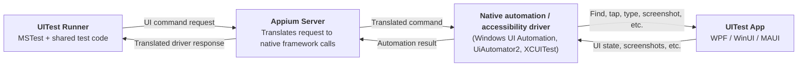
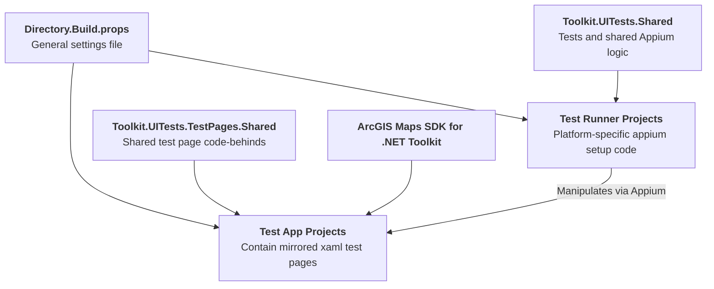

# .NET Toolkit UI Tests
The toolkit's UI Tests use Appium to simulate gestures on all six supported platforms (WPF, WinUI, Maui Android, Maui iOS, and Maui Mac Catalyst).

## Structure
At runtime, the test system works as a layered request chain. A **Test Runner** interfaces with an **Appium server** to manipulate a **Test App**.



### Test Runner Projects
Each platform has its own test runner project with the naming convention `Toolkit.UITests.Platform`. Each test project is an MSTest SDK application that can run either in its own console or using VSTest.

Almost all code, including individual tests, is shared between the projects in the [`Toolkit.UITests.Shared`](./Toolkit.UITests.Shared) library. Only minimal setup code is present in the projects themselves.

> [!NOTE]
> Because of limitations from Appium, Windows tests must be run from Windows machines, and Mac/iOS tests must be run from Mac devices. The Android test runner works on either platform. See the table below for quick reference.
> | Required Platform | Runners |
> | --- | --- |
> | Windows | `.MauiWinUI`, `.WinUI`, `.WPF` |
> | Mac | `.MauiiOS`, `.MauiMac` |
> | Either | `.MauiAndroid` |

### Test App Projects
Each framework (WPF, WinUI, and Maui) has a test app project with the naming convention `Toolkit.UITests.Framework.App`. Test apps make use of the ArcGIS Maps SDK for .NET Toolkit and are manipulated by the test runners during test execution.

Each app contains a collection of mirrored test pages. Xaml files are necessarily unique to each framework, but code-behinds are shared in the [`Toolkit.UITests.TestPages.Shared`](./Toolkit.UITests.TestPages.Shared) library.

### Architecture Diagram



## Appium Inspector
It is highly recommended that you install Appium Inspector for troubleshooting appium setup and testing. Downloads and documentation can be found here: https://github.com/appium/appium-inspector/.


## Setting Up the Tests
Appium must be installed and running on the machine before executing any tests.

See the appium documentation for instructions installing appium and drivers: https://appium.io/docs/en/latest/quickstart/install/

### Drivers
The following drivers are needed to run the tests:
| Platforms | Driver Name | Links |
| --- | --- | --- |
| WPF, WinUI, Maui WinUI | windows | GitHub: https://github.com/appium/appium-windows-driver |
| Maui Android | uiautomator2 | GitHub: https://github.com/appium/appium-uiautomator2-driver |
| Maui iOS | xcuitest | GitHub: https://github.com/appium/appium-xcuitest-driver <br>Documentation: https://appium.github.io/appium-xcuitest-driver/latest/ |
| Maui MacCatalyst | mac2 | GitHub: https://github.com/appium/appium-mac2-driver |

Use `appium driver install <drivername>` to install drivers. Check installations using `appium driver doctor <drivername>`.

#### uiautomator2
To install the bundletool.jar dependency on windows you must make sure it is in `PATH` and add `.jar` to `PATHEXT`. You may also need to `chmod +x` the file.

#### xcuitest
XCUITest can be an involved setup. Some of the install settings listed in the documentation are configurable in the tests. See below.


## Running the Tests
Before running any tests, first open a terminal on the host machine and start appium. (This is done by executing the `appium` command with no arguments.)

The `.Wpf`, `.MauiWinUI`, and `.MauiiOS` test runners will automatically build their respective `.App`s before tests are run. The `WinUI`, `MauiAndroid`, and `MauiMac` test apps must be built and run manually before starting their test runners.

Please be sure to consult the `MauiiOS` section below as it requires additional configuration before tests can run.

### General Notes
Running the MacCatalyst test or any of the Windows tests will take over your machine. Moving the mouse is still possible but may interfere with the tests. Tests will abort if the test app gets closed (pressing the close button or `Alt+F4` are both options).

Be sure to turn off any screen overlays like blue light filters before running the tests. Appium takes screenshots of the entire screen, not just renders of components, so any overlays will get included in screenshots and affect image analysis tests.

### WinUI
Currently automatic building of WinUI is not set up. To run the tests, first build and run the `Toolkit.UITests.WinUI.App` project to install the test app on your machine. This must be done before starting the `.WinUI` test runner, and must be done manually any time a new change needs testing.

### MauiAndroid
In Debug mode Maui Android uses a FastDeploy process which skips embedding some assemblies into the generated APK. Appium cannot install these APKs, so instead the Maui test app must first be run (and therefore installed) on the target device using the dotnet commandline or visual studio. This must be done before starting the `.MauiAndroid` test runner, and must be done manually any time a new change needs testing.

> Note: The [`UITests/Directory.Build.props`](./Directory.Build.props) file does include an option to not use a preinstalled app (set `AndroidUsePreinstalledApp` to `false` or nothing). This will cause the `.MauiAndroid` build process to attempt to build the `.Maui.App` app in `Release` mode before tests run. This is not recommended as the `Release` build is slow, appears to do a full rebuild each time, and may not work at all if `.MauiAndroid` itself is being built in `Debug`.

### MauiMac
Currently automatic building of the MacCatalyst test app is not configured. To run the tests, first build and run the `Toolkit.UITests.Maui.App` project to install the test app on your machine. This must be done before starting the `.MauiMac` test runner, and must be done manually any time a new change needs testing.

### MauiiOS
XCUITest has a particularly difficult setup documented on its wiki: https://appium.github.io/appium-xcuitest-driver/latest/preparation/. The `.MauiiOS` test runner supports both automatic WDA setup and preinstalled WDA setup configs (though with a limited number of supported options). These options can be configured in the [`UITests/Directory.Build.props`](./Directory.Build.props) file.

To get automatic provisioning working you may need to go through the [Full Manual Configuration](https://appium.github.io/appium-xcuitest-driver/latest/preparation/prov-profile-full-manual/) steps once. Also a signing ID of `Apple Development` may work better than the suggested `Apple Developer` suggested in the automatic provisioning docs.


## Contributing
### Quick Start
The easiest way to get started making a new test is to use the included template. The following snippets assume commands will be run from the root of the toolkit repository.

The template can be installed by running
```sh
dotnet new install ./src/Tests/UITests/extensions/
```

To see the template's options run
```sh
dotnet new toolkit-uitest -h
```

Try the template out by running the following on a clean tree:
```sh
dotnet new toolkit-uitest --output ./src/Tests/UITests/ -C ExampleControl -P ExampleTestPage -T ExampleControlTests
```

If you run `git status` you should see 5 new untracked files have been added. At this point if you have Visual Studio open on Windows it is a good idea to close and reopen it. If you have Appium installed and running you should be able to run the new `ExampleControl_CompassAutoHideExample` test from the Visual Studio Test Explorer.

From here you can refer to the generated files and compare them to existing tests to get a better idea of how the framework functions. After you have a good idea of how things work you can re-run the template with a real control name and more fitting page and/or test names, and start developing your test.

### Guidelines
The intent of the UITests is to allow as much code as possible to be shared between frameworks and platforms. Towards this goal, test pages created for the app projects should be as similar as possible. The recommended way to create a test page is to use the template as outlined in the [Quick Start](#quick-start) section above.

If test pages must be created manually, the cross-framework [`TestPage`](./Toolkit.UITests.TestPages.Shared/TestPage.cs) class can be used to help share code-behind logic across the different apps. You can refer to existing test pages such as [`CompassMap.xaml.cs`](./Toolkit.UITests.TestPages.Shared/CompassMap.xaml.cs) to see how the class is used.

Try to keep tests small with few steps. On some platforms in particular the lag between an instruction being sent by the test runner, translated by the appium server, sent to the test app, sent back to appium, and finally sent back to the runner can be quite long.

We avoid doing direct screenshot comparisons in favor of light image analysis like blob counting. The [ImageMagick](https://imagemagick.org/) library (see [here](https://github.com/dlemstra/Magick.NET) for the .NET-specific repo) is included in the test runner projects for use in custom analyses. If you see a similar analysis being used by multiple separate tests consider consolidating it as a single function in a new image comparison class.

### Platform-Specific Code
Platform-specific code can be achieved by either
1. Using preprocessor constants in one of the shared libraries, or
2. Creating a file in a non-shared project
   - Platform-specific xaml files are a great example of this

Custom preprocessor constants include the following.
| Project Type | Constants |
|--- | --- |
| Runners | `WINDOWS_RUNNER`, `MAC_RUNNER`, `WPF_TEST`, `WINUI_TEST`, `MAUI_TEST`, `WINDOWS_TEST`, `ANDROID_TEST`, `MAC_TEST`, `IOS_TEST` |
| Apps | `WPF_APP`, `WINUI_APP`, `MAUI_APP` (Maui also provides its own automatic constants for different platforms) |